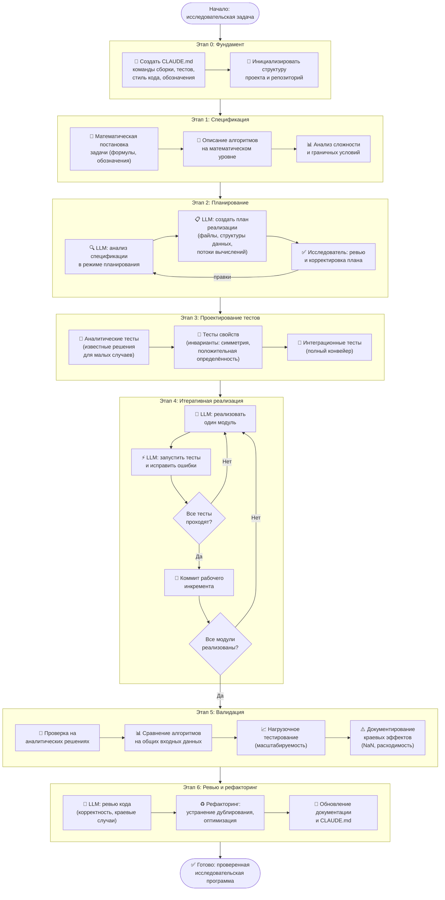
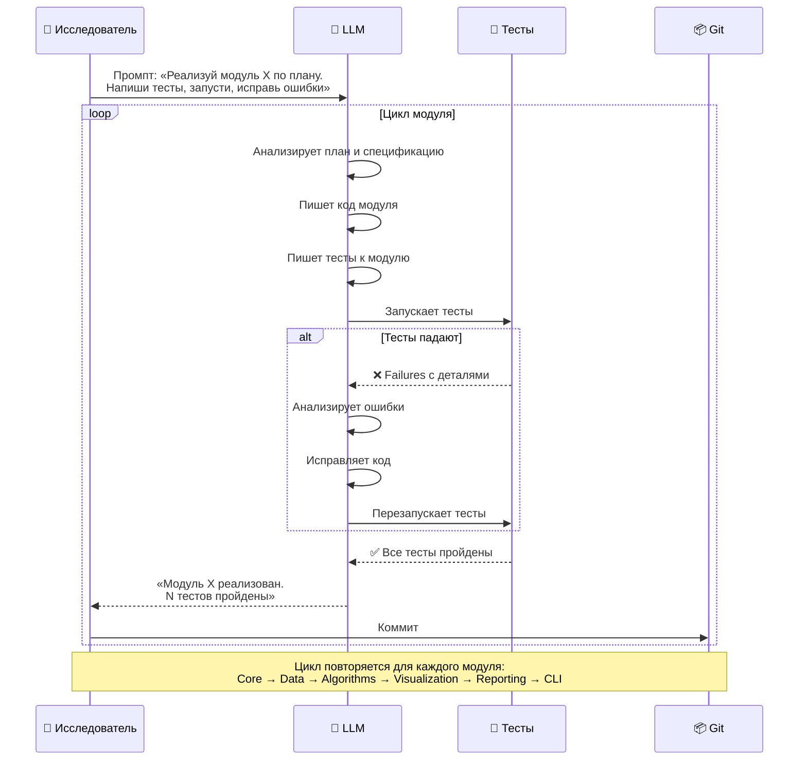
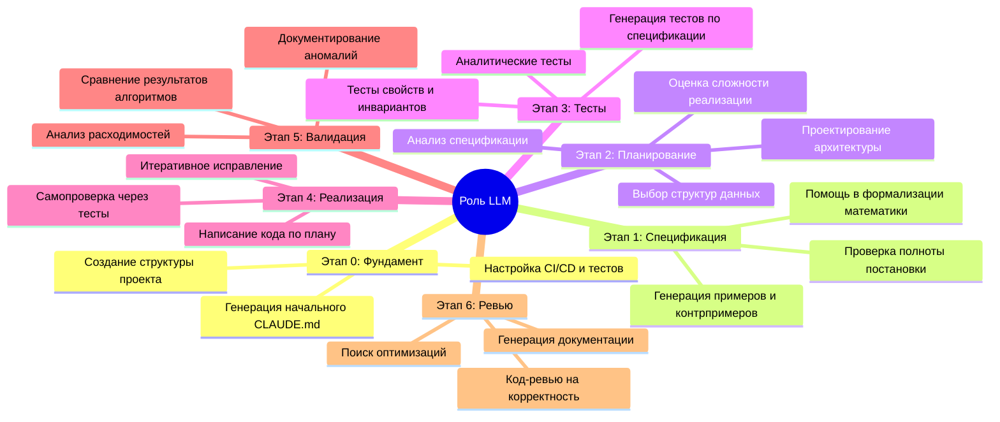
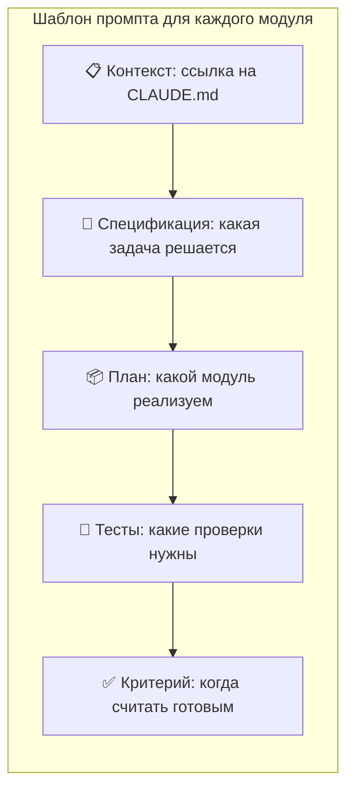
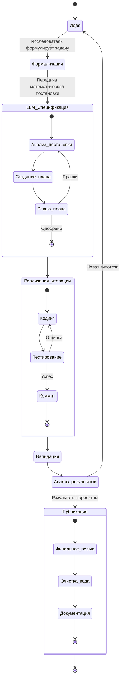
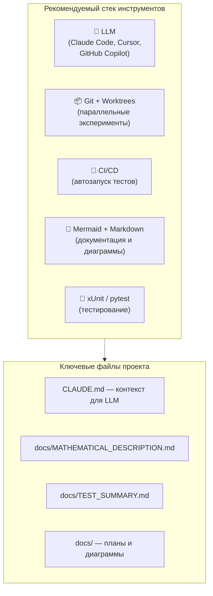

# Процесс работы с LLM при разработке исследовательского ПО

> Диаграмма описывает оптимальный процесс взаимодействия исследователя с LLM
> (Claude Code, GPT и др.) для написания программ научных вычислений.
>
> Пример основан на проекте **Quadratic Placement Solver**, но подход универсален.

---

## Общая схема процесса



---

## Детальная схема итеративного цикла реализации (Этап 4)



---

## Роль LLM на каждом этапе



---

## Пример промптов для проекта Quadratic Placement



### Пример конкретного промпта

```
Реализуй модуль QuadraticPlacement.Core по плану.

Контекст: см. CLAUDE.md (команда сборки: dotnet build)
Спецификация: см. docs/MATHEMATICAL_DESCRIPTION.md

Необходимо:
1. Создать модели данных: Graph, Edge, FixedVertex, Metrics
2. Создать интерфейс IPlacementSolver
3. Реализовать SparseMatrixCSR для разреженных матриц

Тесты:
- Единичная матрица в CSR формате
- Симметричная матрица 3×3
- Пустая матрица

Запусти тесты (dotnet test) и исправь ошибки.
Не переходи к следующему модулю, пока все тесты не пройдут.
```

---

## Жизненный цикл итерации исследования



---

## Ключевые принципы

| # | Принцип | Почему это важно |
|---|---------|-----------------|
| 1 | **Сначала спецификация, потом код** | LLM точнее реализует формальную математику, чем словесное описание |
| 2 | **Отделять планирование от реализации** | Позволяет скорректировать архитектуру до написания кода |
| 3 | **TDD: тесты до реализации** | Тесты определяют критерий готовности; LLM итерирует до их прохождения |
| 4 | **Давать LLM возможность самопроверки** | LLM работает значительно лучше, когда может запускать тесты и видеть результат |
| 5 | **Малые итерации с коммитами** | Ошибки дешевле исправлять сразу; всегда есть точка отката |
| 6 | **Валидация на известных решениях** | Единственный способ убедиться в корректности научного кода |
| 7 | **Исследователь проверяет математику** | LLM реализует алгоритм, но человек должен верифицировать постановку задачи |
| 8 | **Обновлять CLAUDE.md** | Накопленный контекст помогает LLM в следующих сессиях |

---

## Инструменты и форматы



---

> **Как читать эту диаграмму:** Откройте файл в VS Code с расширением *Markdown Preview Mermaid Support*
> или на [mermaid.live](https://mermaid.live) для рендеринга.
